# Oracle SQL Data Engineering & Relational Database Analysis

Oracle SQL 기반 관계형 데이터베이스 설계, 고급 질의 처리, 다차원 집계 및 데이터 분석 프로젝트

---

## Overview

본 프로젝트는 Oracle RDBMS 환경에서 관계형 데이터베이스를 직접 설계하고,
복합 비즈니스 로직 및 분석 질의를 SQL 기반으로 구현한 데이터 엔지니어링 프로젝트입니다.

단순 CRUD 처리 수준을 넘어 다음과 같은 핵심 기능을 구현하였습니다.

- 관계형 스키마 설계 및 무결성 관리
- JOIN 및 Subquery 기반 데이터 병합
- PIVOT / ROLLUP 기반 다차원 집계
- Window Function 기반 순위 분석
- CONNECT BY 기반 계층형 데이터 탐색
- Transaction 및 권한 제어

---

## Tech Stack

| Category | Skills |
|---|---|
| DBMS | Oracle Database |
| Query Language | Oracle SQL |
| Tool | SQL Developer |
| Database Design | PK, FK, CHECK, CASCADE |
| Query Processing | JOIN, Subquery, Aggregation |
| Advanced SQL | ROLLUP, PIVOT, RANK, CONNECT BY |
| Transaction Control | COMMIT, ROLLBACK, SAVEPOINT |

---

## Project Structure

```text
relational-db-analysis-oracle/
│
├── schema/
│   ├── create_tables.sql
│   ├── constraints.sql
│   ├── schema_modification.sql
│   └── drop_tables.sql
│
├── queries/
│   ├── basic_filtering.sql
│   ├── data_transformation.sql
│   ├── aggregation.sql
│   ├── basic_join.sql
│   ├── correlated_subquery.sql
│   ├── hierarchical_query.sql
│   ├── ranking_analysis.sql
│   ├── pivot_analysis.sql
│   └── transaction_control.sql
│
├── docs/
│   ├── sql_summary.md
│   └── execution_plan_notes.md
│
├── optimization/
│   └── query_optimization.md
│
├── results/
│
└── assets/
```

---

## Entity Relationship Diagram

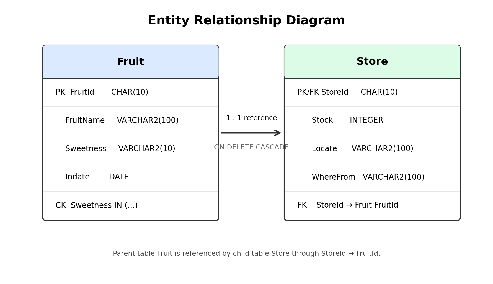
---

## Core Engineering Tasks

### 1. Relational Database Modeling

- Parent-Child 테이블 구조 설계
- PK/FK 기반 참조 무결성 구성
- CHECK Constraint 기반 데이터 검증
- ON DELETE CASCADE 기반 데이터 정합성 유지

### 2. Analytical SQL Processing

- BMI 파생 변수 생성
- CASE / DECODE 기반 데이터 변환
- GROUP BY 및 HAVING 기반 집계 분석
- PIVOT 기반 다차원 교차 집계

### 3. Advanced Query Engineering

- INNER / OUTER JOIN 기반 데이터 병합
- Non-Equi Join 기반 범위 매핑
- EXISTS 기반 연관 서브쿼리 구현
- VIEW 기반 재사용 가능한 질의 구조 설계

### 4. Hierarchical & Ranking Analysis

- DENSE_RANK 기반 그룹 내 순위 분석
- ROLLUP / GROUPING SETS 기반 다단계 집계
- CONNECT BY 기반 계층형 조직 구조 탐색
- Window Function 기반 누적 집계 분석

### 5. Transaction & Privilege Management

- COMMIT / ROLLBACK 기반 트랜잭션 제어
- SAVEPOINT 기반 부분 복구 처리
- GRANT / REVOKE 기반 권한 관리
- ROLE 기반 사용자 권한 구성

---

## SQL Module Summary

| Module | File | Main Topics |
|---|---|---|
| Schema Design | `schema/create_tables.sql` | DDL, PK, FK, CHECK, CASCADE |
| Schema Modification | `schema/schema_modification.sql` | ALTER, RENAME, MODIFY |
| Basic Filtering | `queries/basic_filtering.sql` | INSERT, UPDATE, LIKE, DISTINCT |
| Data Transformation | `queries/data_transformation.sql` | CASE, DECODE, NVL, MERGE |
| Aggregation | `queries/aggregation.sql` | GROUP BY, HAVING, Aggregate Functions |
| Join Processing | `queries/basic_join.sql` | INNER JOIN, OUTER JOIN, Non-Equi Join |
| Subquery & View | `queries/correlated_subquery.sql` | EXISTS, Correlated Subquery, VIEW |
| Hierarchical Query | `queries/hierarchical_query.sql` | CONNECT BY, LEVEL, PATH |
| Analytical Functions | `queries/ranking_analysis.sql` | ROLLUP, GROUPING SETS, RANK |
| Pivot Analysis | `queries/pivot_analysis.sql` | PIVOT, multidimensional aggregation |
| Transaction Control | `queries/transaction_control.sql` | COMMIT, SAVEPOINT, GRANT, REVOKE |

---

## Engineering Insights

### Query Optimization Awareness

실습 환경에서는 성능 차이가 크지 않았으나,
대용량 데이터 환경에서는 실행 계획(Execution Plan),
인덱스 전략, JOIN 순서가 쿼리 성능에 직접적인 영향을 준다는 점을 확인하였습니다.

### Data Integrity vs Operational Flexibility

강한 참조 무결성 유지와 실제 운영 환경에서 요구되는
복구 가능성 및 이력 관리 사이에는 Trade-off가 존재함을 학습하였습니다.

### SQL Structuring & Maintainability

복잡한 분석 질의는 단순 동작 여부뿐 아니라
가독성 및 유지보수성까지 고려해야 하며,
CTE 및 Inline View 기반 구조화의 중요성을 인지하였습니다.

---

# Example Query Results

## 1. Schema Definition

### Table Creation

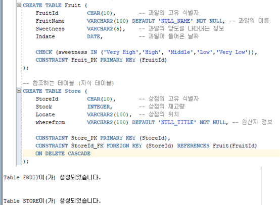

### Fruit Table Structure

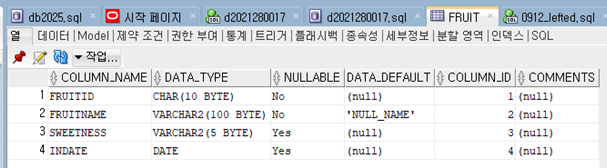

### Store Table Structure

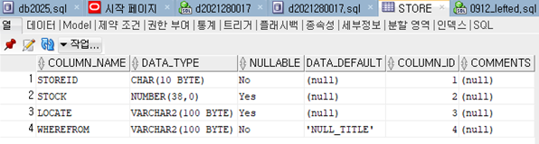

---

## 2. Data Filtering

### Conditional Filtering Result

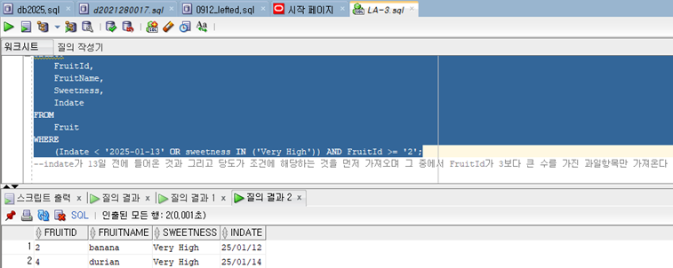

---

## 3. Data Transformation

### BMI Calculation

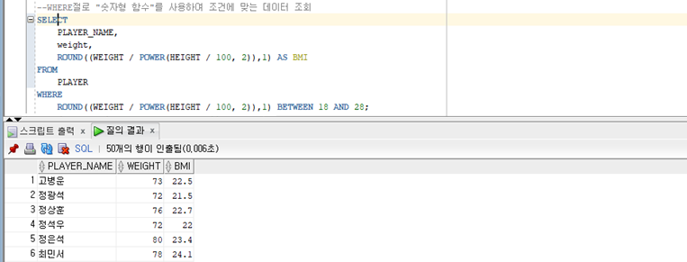

### CASE / DECODE Transformation

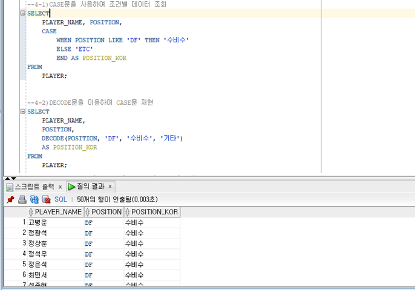

---

## 4. Aggregation Analysis

### Position Aggregation

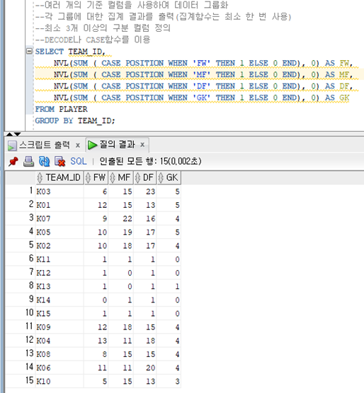

### ROLLUP Aggregation

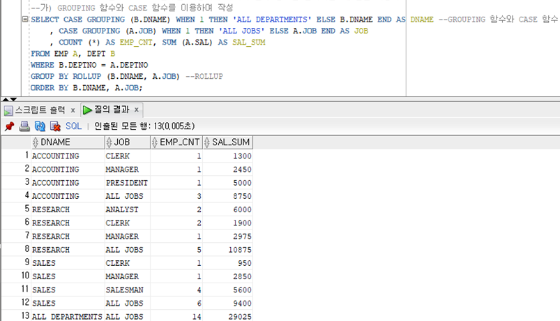

---

## 5. JOIN Processing

### Multi-table INNER JOIN

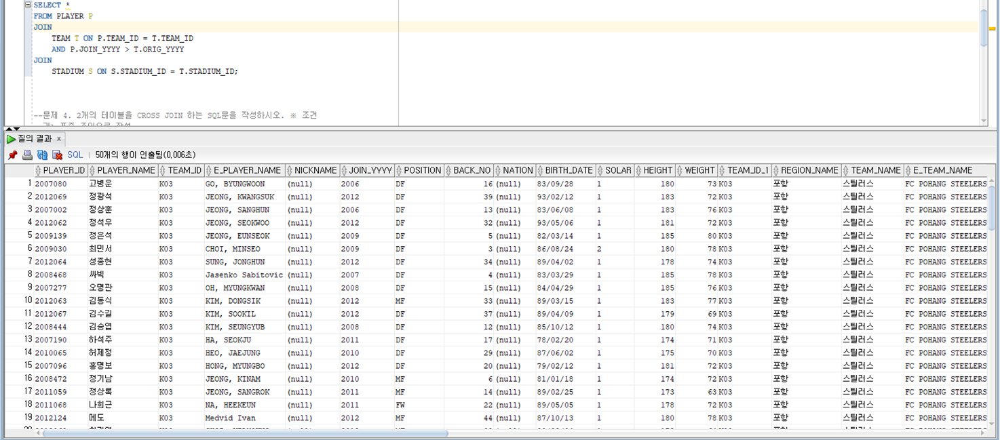

### Non-Equi Join

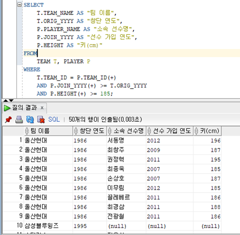

---

## 6. Subquery & View

### Correlated Subquery

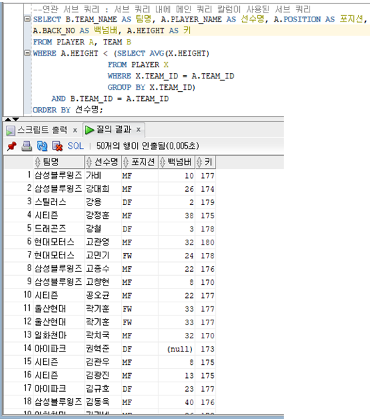

### View Query

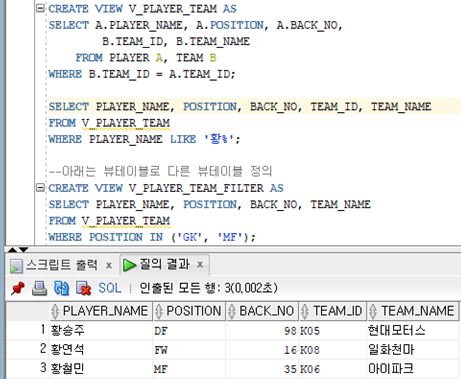

---

## 7. Analytical Functions

### DENSE_RANK Analysis

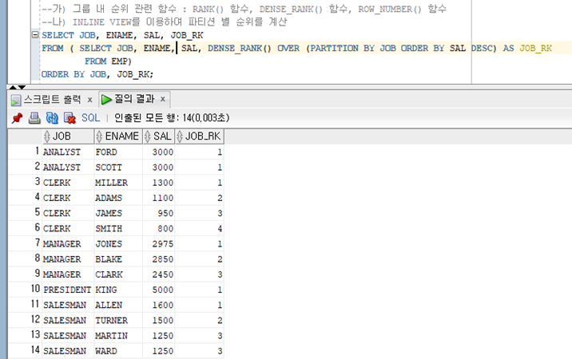

### PIVOT Aggregation

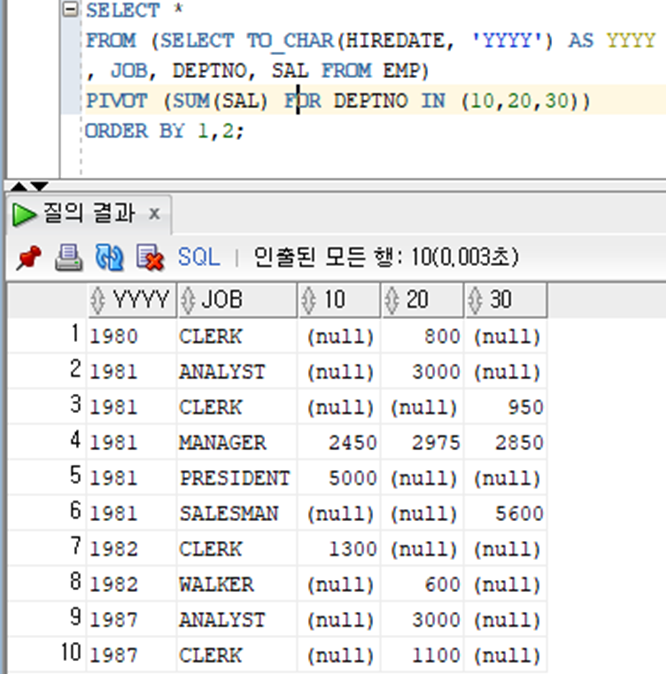

---

## 8. Hierarchical Query

### Hierarchical Tree Structure

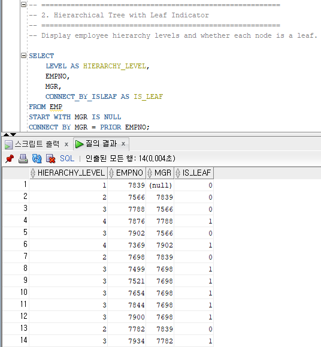

### Hierarchical Path Analysis

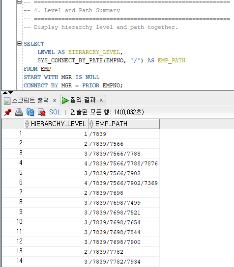
